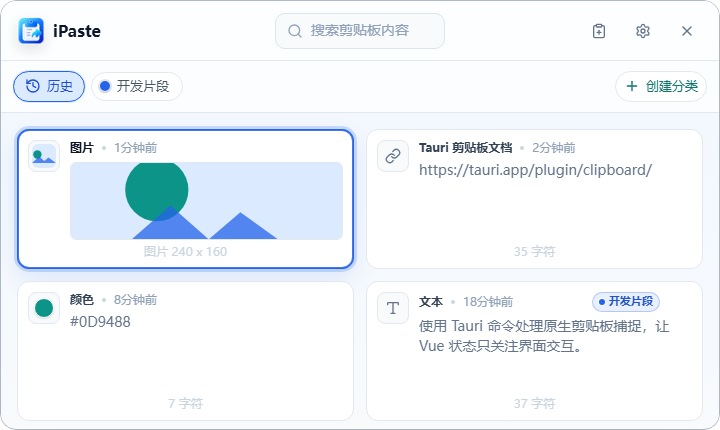

# iPaste

> 一款本地优先的 macOS 和 Windows 剪贴板管理器，专注快速找回、清晰整理和私密的日常工作流。

iPaste 常驻托盘，在本地监听剪贴板，并在你需要找回旧内容时打开一个紧凑、键盘优先的面板。它适合经常在笔记、聊天、终端、浏览器、设计工具和代码编辑器之间切换的人，让剪贴板历史变得可靠，而不是用完即丢。



## 功能亮点

- 本地优先的剪贴板历史，支持文本、链接、颜色、HTML 片段和图片。
- 全局快捷键唤起面板，支持搜索、键盘导航，并可直接粘贴回之前的应用。
- 保存分类可用于长期复用代码片段、提示词、回复、地址、命令等内容。
- 图片支持预览、缩放、旋转、复制回剪贴板，以及 OCR 文本提取。
- 可选的追加复制模式，可把多次文本复制合并为一个临时片段。
- 可配置历史保留策略、面板布局、启动行为和全局快捷键。
- 可选的自托管云同步，仅同步保存分类；原始剪贴板历史始终保留在本地。
- 内置 Tauri 签名更新支持，也可通过 Cloudflare R2 分发更新产物。

## 隐私模型

iPaste 从设计上就是本地优先。

- 剪贴板历史存储在当前设备的本地 SQLite 数据库中。
- 自动捕获的剪贴板历史不会被同步。
- 启用云同步时，只会同步保存分类和已保存的类文本分类条目。
- 图片和文件片段目前不在云同步载荷中。
- Tauri 更新器会在安装前校验已签名的发布产物。

## 平台支持

| 平台 | 状态 | 说明 |
| --- | --- | --- |
| macOS | 已支持 | 自动粘贴需要辅助功能权限；图片 OCR 使用系统 Vision 框架。 |
| Windows | 已支持 | 图片 OCR 使用可下载的 Tesseract 资源。 |
| Linux | 暂未作为目标平台 | Tauri 可能可以通过额外工作运行，但当前仓库聚焦 macOS 和 Windows。 |

## 技术栈

- Tauri 2：桌面外壳、托盘、窗口、更新器和原生系统集成。
- Rust：剪贴板捕获、SQLite 存储、全局快捷键、粘贴自动化、OCR 管线和同步编排。
- Vue 3、TypeScript、Pinia、Vite 和 Tailwind CSS 4：应用界面。
- `rusqlite`：本地 SQLite 持久化。
- Cloudflare Pages/Workers 兼容 API：可选同步服务。

## 开始使用

### 环境要求

- Node.js 22 或更高版本。
- npm 10 或更高版本。
- Rust stable 工具链。
- 当前操作系统所需的 Tauri 2 平台依赖。

macOS 开发还需要 Xcode Command Line Tools。Windows 开发需要安装 Microsoft C++ Build Tools；如果系统中没有 WebView2 Runtime，也需要一并安装。

### 安装依赖

```bash
npm install
```

### 运行 Web 预览

```bash
npm run dev
```

浏览器预览会在原生 Tauri API 不可用时使用模拟数据。它适合做界面开发，但不会捕获真实系统剪贴板。

### 运行桌面应用

```bash
npm run tauri dev
```

### 构建

```bash
npm run build
npm run tauri build
```

快速检查原生编译：

```bash
cargo check --manifest-path src-tauri/Cargo.toml
```

## 项目结构

```text
.
├── src/                  # Vue 应用、store、组件和前端 API 封装
├── src-tauri/            # Tauri 配置和 Rust 桌面后端
├── scripts/              # 发布和更新器分发工具
├── docs/                 # 运维文档和项目笔记
├── key/                  # 仅保留公开更新器公钥；私钥不得进入 git
└── .github/workflows/    # 已签名桌面构建的发布工作流
```

## 核心工作流

### 剪贴板捕获

Rust 后端会在后台监听系统剪贴板，对受支持的内容进行规范化，写入 SQLite，并把更新事件发送给 Vue 面板。类文本片段会按内容哈希去重。图片片段会作为本地应用数据资源保存，并通过 Tauri 资源协议渲染。

### 应用片段

从 iPaste 粘贴时，应用会先把选中的片段写回系统剪贴板，再触发平台粘贴快捷键。macOS 上的直接粘贴步骤需要辅助功能权限。

### 保存分类

历史片段和保存分类条目是两个不同概念。历史条目会根据保留策略过期；保存分类条目则是用户明确保存的快照，会一直保留到用户删除为止。

### 云同步

桌面应用可以在偏好设置中配置 API 地址和 API Key，连接到自托管的 iPaste 同步 API。同步范围包括分类和已保存的类文本分类条目。同步服务源码位于当前仓库之外的 `ipaste_server`。

### 图片 OCR

macOS 使用系统 Vision 框架。Windows 使用可在应用偏好设置中安装的 Tesseract 资源。当配置了 `IPASTE_OCR_R2_BASE_URL` 或 `IPASTE_UPDATER_R2_ENDPOINT` 时，发布自动化可以把 OCR 清单和资源镜像到 R2。

## 参与贡献

仓库公开并补充许可证后，欢迎贡献。

适合优先探索的方向：

- `src/components` 中的小型界面细节。
- `src/lib` 中的剪贴板类型处理和格式化辅助函数。
- [src-tauri/src/lib.rs](src-tauri/src/lib.rs) 中的原生行为和存储改进。
- 文档、环境搭建说明和发布检查清单。

提交 Pull Request 前请运行：

```bash
npm run build
cargo check --manifest-path src-tauri/Cargo.toml
```

请保持项目本地优先、尊重隐私，并谨慎处理任何会同步用户数据的改动。

## 许可证

当前尚未声明开源许可证。在接受外部贡献或公开发布为开源项目之前，请先添加 `LICENSE` 文件。
